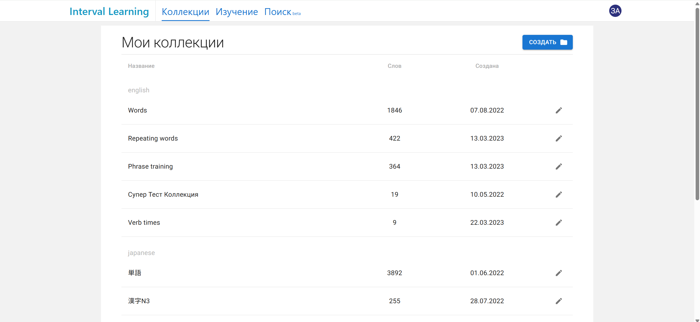
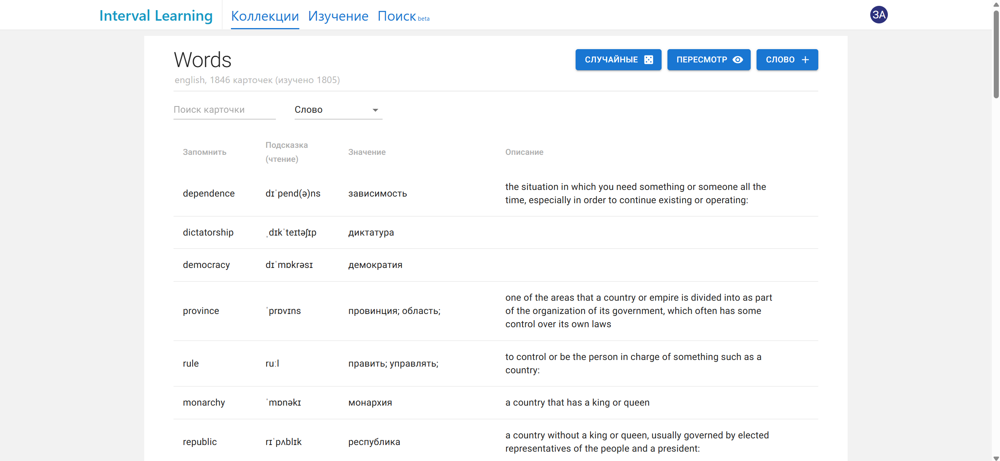
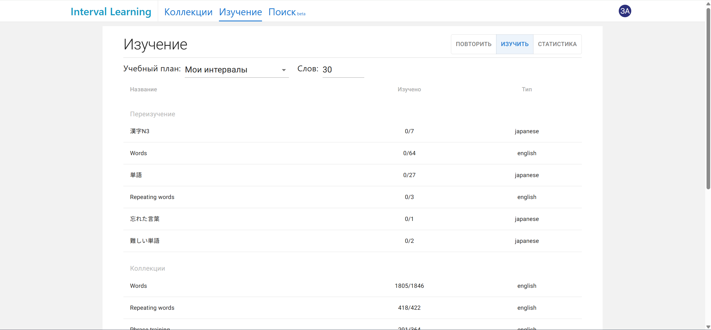
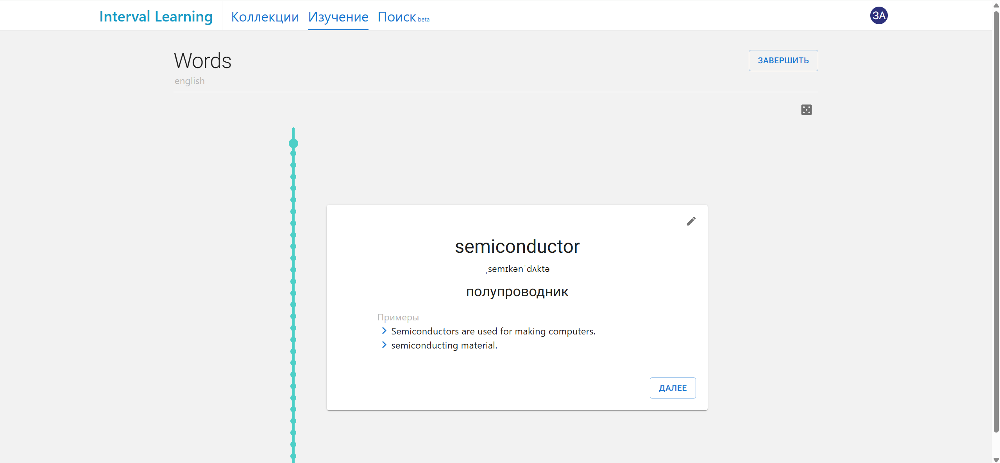
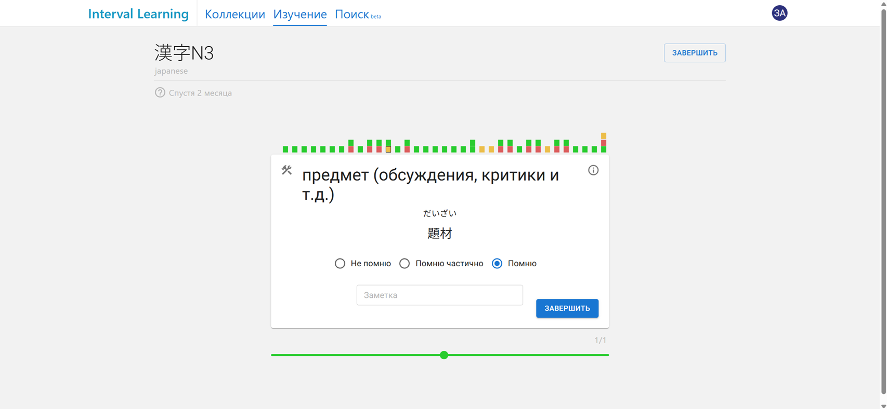
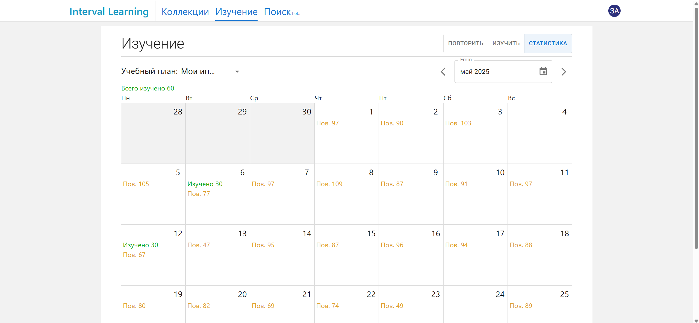
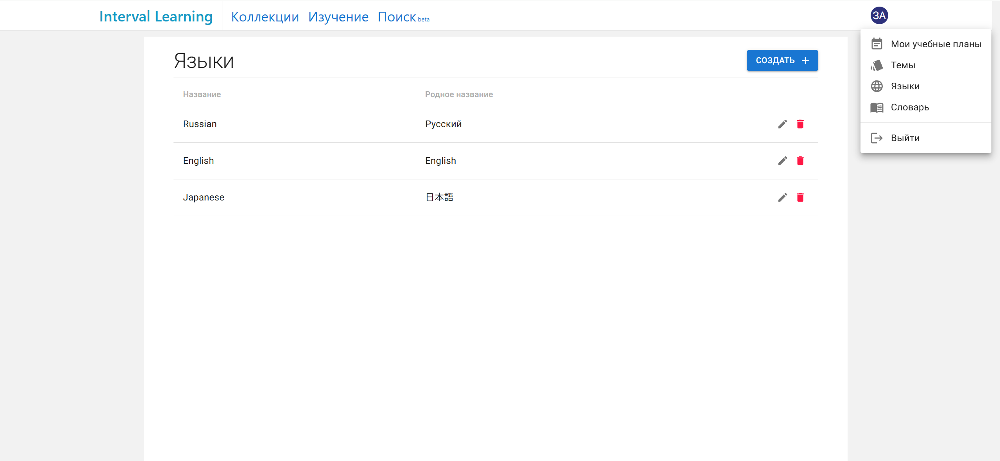

## Описание

Веб-сервис для интервального повторения. Автор сервиса использует его более 4 лет и выучил с помощью него Японский до N2 уровня и Английский до B2.

Основные фичи:

- Коллекции
  - По тема
  - Без ограничений по кол-ву карточек в коллекции
  - Формирование коллекции из рандомных слов
    - Слова формируются из известных системе (те что использовались в карточках)
    - Напрямую в БД можно залить слова в словарик, тогда можно будет формировать из них. Полезно, когда хочешь изучить топ 3000 слов английского например.
    - Можно пересмотреть коллекцию карточке, чтобы найти забытые слова
  - Создание публичных коллекции (они отображаются во вкладке "Поиск")
    - Удобно если хочется поделиться коллекций с другими пользователями
- Карточки
  - Структура: Подсказки, Примеры, Теги, Описание
  - При заполнении карточки автоматичемски идет поиск перевода
- Обучение
  - Гибкие планы обучения
    - Можно задавать свои интервалы
    - Оставлять описание, чтобы рассказать технику обучения своим друзьям
    - Выбирать поведение при забывании
  - Изучение
    - При изучении показывается прогресс
    - Можно преждевременно закончить изучение слов, если появились дела
  - Повторение
    - При повторении по дефолту показывает перевод, а подсказка и перевод скрыт
    - По клику можно раскрыть подсказку к слову, которая написана в карточке
    - При нажатии одной из кнопок (Запомнил, помню частично, не помню) все подсказки и перевод раскрываются
    - Если система видит, что пользователь на двух этапах выбрал, что забыл слово, то оно откатывает карточку в самое начало
      - Похожа логика работает и других вариантов ответов. Автор заложил её основываясь на своем опыте.
  - Темы
    - Возможность создание тем для коллекций
  - Языки
    - Возможность добавления новых языков в систему
    - Возможность задать ссылку на словарь. Ссылка потом отображается при заполнении карточки
  - Словарь
    - Возможность загружать переводы в систему
      - Если перевода не сущетсвует, он создается
      - Если существует
        - Обновляется произношение слова
        - Добавляются варианты перевода, которых нет в системе
- Статистика (Календарь)
  - Выводит календарь за месяц, где описывается сколько было изучено слов в какой день
  - Выводит общее количество изученных и повторенных слов
- Поиск (бета)
  - Поиск публичных коллекций по темам
  - Добавление публичных коллекций себе
  - Просмотр лайков и дизлайков публичной коллекции

## Скриншоты

### Список коллекций


### Список карточек


### Выбор коллекции для изучения


### Изучение карточек


### Повторение карточки


### Статистика изучения


### Список языков



## Установка сервиса на своем компьютее

1. Для работы сервиса необходим Docker. [Как установить Docker.](https://docs.docker.com/desktop/setup/install/windows-install/)
2. Скачать данный репозиторий
3. Перейти корневую папку репозитория
4. Запустить скрипт `build.ps1`. Скрипт создаст свежий образ сервиса в Docker.
5. Запустить скрипт `start-prod.ps1`. Скрипт создаст контейнеры и запустит сервис. В последствии выключать и включать сервис нужно прямо из интерфейса докера. Использовать этот скрипт только для создания докер контейнеров. Не гарантируется корректная работа при использования этого скрипта для простого запуска контейнера.
6. В корневой папке сервиса должна создаться папка `pgdata`. Это база данных, которую использует сервис, её можно архивировать и сохранять например на гугл диске. В будущем для использования существующей базы данных, просто подложите существующую папку.

# Для создания локальной базы

```
docker run --name interval-learning-db -p 5432:5432 -e POSTGRES_USER=postgres -e POSTGRES_PASSWORD=postgres -e POSTGRES_DB=postgres -d postgres
```

# Для деплоя используем

```docker
docker-compose -f docker-compose.yml -f docker-compose.production.yml up -d
```

# PowerShell скрипты

| Скрипт                              | Описание                                                                                                                                                                                                                                                          |
| ----------------------------------- | ----------------------------------------------------------------------------------------------------------------------------------------------------------------------------------------------------------------------------------------------------------------- |
| `build.ps1`                         | Основной скрипт сборки. Генерирует SSL-сертификаты через `nginx/update-keys.ps1`, подставляет секреты из `secrets.json` (или `secrets.template.json` если `secrets.json` не найден) в template-файлы docker-compose, после чего запускает `docker compose build`. |
| `start-prod.ps1`                    | Запускает сервис через `docker compose up` с production-конфигурацией. Использовать только для первоначального создания контейнеров.                                                                                                                              |
| `open-dev-env.ps1`                  | Открывает среду разработки: GitExtensions, решение бэкенда в Visual Studio, фронтенд в VS Code и запускает dev-сервер фронтенда.                                                                                                                                  |
| `nginx/update-keys.ps1`             | Устанавливает `mkcert` (через Chocolatey), создаёт локальный SSL-сертификат для `localhost` и переименовывает файлы в `fullchain.pem` / `privkey.pem` для nginx.                                                                                                  |
| `scripts/add-initial-db-values.ps1` | Заполняет базу данных начальными значениями (языки, темы). Запускать один раз после первого старта сервиса.                                                                                                                                                       |
| `interval-learning-web/dev.ps1`     | Запускает dev-сервер фронтенда (`yarn dev`). Вызывается из `open-dev-env.ps1`.                                                                                                                                                                                    |

## Секреты

В корне репозитория должен лежать файл `secrets.json` (не коммитится в git). Структуру файла см. в `secrets.template.json`.

```json
{
  "Development": {
    "Database": {
      "Host": "postgres",
      "Port": "5432",
      "DatabaseName": "...",
      "Username": "...",
      "Password": "..."
    }
  },
  "Production": {
    "Database": {
      "Host": "postgres",
      "Port": "5432",
      "DatabaseName": "...",
      "Username": "...",
      "Password": "..."
    }
  }
}
```
